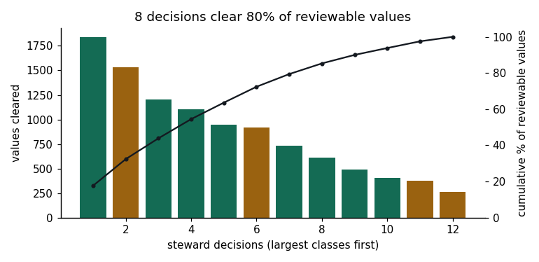

# Enrichment Review Console

[](https://github.com/harshagarwal2412-cell/enrichment-review-console/actions/workflows/ci.yml)

**Live demo:** https://harshagarwal2412-cell.github.io/enrichment-review-console/

## Problem

AI product-information tools can now enrich thousands of SKUs in hours. Proton PIM advertises 10,000 SKUs in 5 hours with 15+ fields per SKU. The approval step, though, still happens one value at a time. At about 9 seconds per value, one afternoon's output (~150,000 values) takes a data steward about **375 hours** to review.

In practice, someone bulk-approves instead. Bad values then reach the ERP and the webstore, trust drops, and the next enrichment run doesn't get approved at all. That's how AI features die at adoption rather than at launch.

## Solution

**Review error classes, not values.** Enrichment failures repeat in a few dozen shapes: unit formats, manufacturer aliases, enum drift, values scraped from untrusted sources. The console groups a run by *field × failure mode × source tier* and sorts each class into one of three lanes:

| Lane | Rule | Example |
|---|---|---|
| **Cleared by policy** | Deterministic transform, tier-1 source, ≥2 corroborating sources; 2% audit sample | Voltage `125 volts` → `125 V` |
| **Steward decision** | Needs one judgment call per class | Diameter / Width / OD schema collision |
| **Held** | Never auto-accepted; routed to a named owner | Country of origin from a marketplace listing |

Every decision writes a **scoped, reversible rule** that the next run inherits, so the same class doesn't come back to the queue. In the sample run (830 SKUs, 11,087 values), review time falls from **27.7 hours to 1.4 hours**, with about 700 values cleared per steward decision.

## Architecture

```
src/
├── domain/                 # Pure TypeScript, no React: fully unit-tested
│   ├── types.ts            # ErrorClass, Lane, Action, ReviewState, WrittenRule
│   ├── catalog.ts          # One enrichment run: 15 classes + rule book
│   ├── review.ts           # Lane routing, immutable decide/undo reducer, cost model
│   └── review.test.ts      # Vitest suite
scripts/export-data.ts      # Exports the run to CSV for the analysis layer
analysis/                   # Python + SQL analysis
├── components/
│   ├── Meters.tsx          # Live cost meters + lane distribution bar
│   └── ClassCard.tsx       # Class card, evidence table, lane-specific actions
└── App.tsx                 # State container
```

**Design decisions**

- **Immutable reducer.** `decide()` and `undo()` return new state, so decisions are easy to reason about, test and reverse. A decision moves a class between lanes (demote → review, route → hold) and appends the rule it implies to the ledger.
- **Trust is structural, not probabilistic.** Lane assignment depends on source tier and corroboration count, not on model confidence. Tier-3 sources can never reach the auto lane, and a test enforces this.
- **Cost model in one function.** The steward-time math behind the meters is a single tested function, so the headline numbers can't drift from the logic.

## Testing

**TypeScript (Vitest):** 13 tests cover:

- catalog integrity: every lane action has a rule, and no uncorroborated source is in the auto lane
- lane movement and conservation (lane totals always sum to the run size)
- reducer immutability and undo
- the cost model

The tests also caught a copy error in the first version: it said 68% of values clear automatically, but the data gives 66%. The page now computes that figure instead of hard-coding it.

```bash
npm install
npm test
npm run typecheck
npm run dev

pip install -r analysis/requirements.txt
pytest analysis
```

CI runs both suites on every push: TypeScript type-check + 13 Vitest tests + build, then the SQL queries + 10 pytest tests. `main` deploys to GitHub Pages.

## Data analysis (Python + SQL)

[`analysis/`](analysis/) runs the cost and trust questions in **SQL on SQLite** and **pandas**. See [`analysis/report.ipynb`](analysis/report.ipynb) for the full analysis with charts.

- 7 SQL queries: a cost model computed in SQL, a trust-tier pivot, a Pareto running total, and a policy-violation check that must return zero rows
- pytest confirms the SQL cost model reproduces the web app's exact figures (27.7 h → 1.4 h)



## Tech stack

**Languages:** TypeScript · Python · SQL

React 18 · Vite · Vitest · pandas · matplotlib · SQLite · pytest · Jupyter · GitHub Actions · GitHub Pages

## Data

Synthetic. It's modeled on electrical and industrial distribution catalogs (NEMA ratings, AWG sizes, UNSPSC, UL/CSA listings), not on any customer's data. Figures attributed to Proton come from its public marketing. Not affiliated with or endorsed by Proton.

---

Harsh Agarwal
