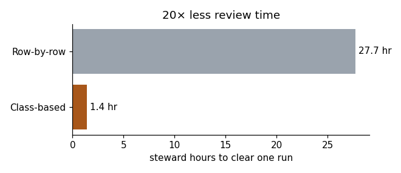

# Analysis: Python + SQL

The cost and trust questions behind the review console, answered with **SQL (SQLite)**, **pandas** and **matplotlib**, and tested with **pytest**.

**Start here:** [`report.ipynb`](report.ipynb) (renders on GitHub with every table and chart).

```
analysis/
├── data/          # CSVs exported from the app's TypeScript catalog (npm run export:data)
├── schema.sql     # 4 tables with keys and CHECK constraints
├── queries/       # one business question per .sql file
├── pipeline.py    # loads CSVs into SQLite, runs queries, returns DataFrames
├── report.ipynb   # the analysis, with charts
└── tests/         # pytest
```

## Questions and findings

| # | Question | SQL techniques |
|---|---|---|
| 01 | How much of the run can be cleared by policy? | `SUM() OVER ()` for share of total |
| 02 | Row-by-row vs. class-based review cost? | parameter table pivoted with `MAX(CASE …)`, cost model in SQL |
| 03 | How does source trust map to lane? | pivot via conditional aggregation |
| 04 | Does any auto-cleared class break the trust policy? | `HAVING` as a data-quality assertion (expects zero rows) |
| 05 | How few decisions clear most of the run? | running total with `ROWS UNBOUNDED PRECEDING` (Pareto) |
| 06 | Which failure modes drive volume? | `GROUP_CONCAT` rollups |
| 07 | What's held, and under which standing rule? | join on a composite key |

**Lane mix (query 01):**

| lane   |   classes |   values |   pct_of_values |
|:-------|----------:|---------:|----------------:|
| auto   |         8 |     7332 |            66.1 |
| review |         4 |     3089 |            27.9 |
| hold   |         3 |      666 |             6   |

**Review cost (query 02):** row-by-row **27.7 hours** → class-based **1.4 hours** (15 decisions + a 147-row audit), or **695 values cleared per decision**.



**Trust matrix (query 03):** only tier-1, corroborated sources ever auto-clear.

|   source_tier |   auto |   review |   hold |   total |
|--------------:|-------:|---------:|-------:|--------:|
|             1 |   7332 |     1182 |      0 |    8514 |
|             2 |      0 |     1907 |    146 |    2053 |
|             3 |      0 |        0 |    520 |     520 |


## Tests

```bash
pip install -r analysis/requirements.txt
python analysis/pipeline.py
pytest analysis -v
```

10 tests cover schema integrity, rule coverage for every lane action, pandas cross-checks, the trust-policy assertion (query 04 must return nothing), and a check that the SQL cost model reproduces the exact figures in the web app.
